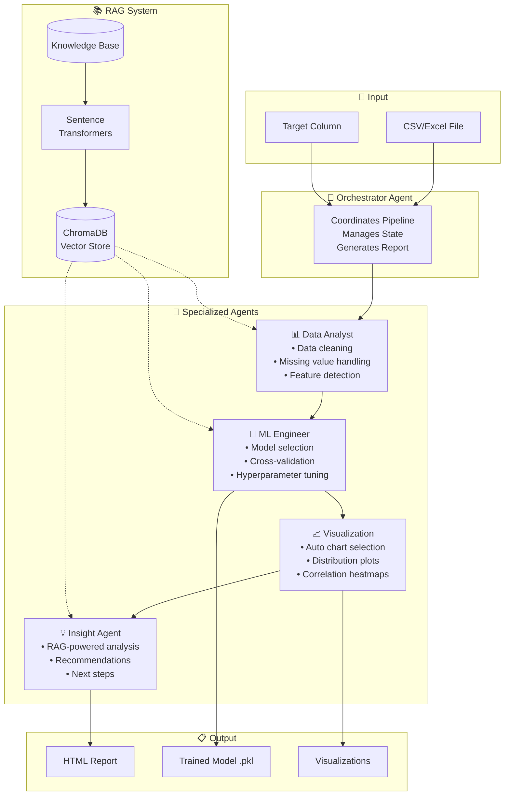

# 🧠 Multi-Agent Data Pipeline Builder

[](https://huggingface.co/spaces/Maheshnath09/data-pipeline-agent)
[](https://www.python.org/downloads/)
[](LICENSE)

An intelligent **multi-agent AI system** that automates the entire data science pipeline—from data cleaning to model training to insight generation. Powered by **5 specialized AI agents** and enhanced with **Retrieval-Augmented Generation (RAG)** for context-aware recommendations.

---

## 🌐 Live Demo

**Try it now:** [🔗 data-pipeline-agent.hf.space](https://maheshnath09-data-pipeline-agent.hf.space)

---

## ✨ Features

| Feature | Description |
|---------|-------------|
| **� 5 AI Agents** | Specialized agents for different pipeline stages |
| **📚 RAG Integration** | ChromaDB-powered knowledge retrieval for best practices |
| **📊 Auto Visualization** | Intelligent chart generation based on data types |
| **🎯 Model Selection** | Automatic model comparison and selection |
| **� AI Insights** | LLM-powered recommendations and analysis |
| **📈 Progress Tracking** | Real-time progress updates during processing |

---

## 🏗️ System Architecture



---

## 🤖 Agent Details

### 1. 🎯 Orchestrator Agent
The central coordinator that manages the entire pipeline:
- Routes tasks to specialized agents
- Maintains shared state between agents
- Tracks progress for UI updates
- Compiles the final HTML report

### 2. 📊 Data Analyst Agent
Handles data understanding and preprocessing:
- Detects data types (numeric, categorical, datetime)
- Handles missing values intelligently
- Removes duplicates
- Extracts datetime features
- Uses RAG for cleaning best practices

### 3. 🔧 ML Engineer Agent
Manages model training and evaluation:
- Automatic task detection (classification vs regression)
- Compares multiple models (RandomForest, GradientBoosting, LogisticRegression)
- 3-fold cross-validation
- Handles class imbalance
- Saves trained model as `.pkl`

### 4. 📈 Visualization Agent
Creates intelligent, context-aware visualizations:
- Dataset overview summary
- Target distribution plots
- Correlation heatmaps
- Feature distribution histograms
- Auto-selects appropriate chart types

### 5. 💡 Insight Agent
Generates AI-powered insights using RAG:
- Queries knowledge base for best practices
- Summarizes key findings
- Provides actionable recommendations
- Suggests next steps for improvement

---

## 📚 RAG System

The **Retrieval-Augmented Generation** system enhances agent responses with domain knowledge:

| Component | Technology | Purpose |
|-----------|------------|---------|
| Vector Store | ChromaDB | Stores and retrieves document embeddings |
| Embeddings | sentence-transformers (all-MiniLM-L6-v2) | Converts text to vector representations |
| Knowledge Base | Markdown documents | ML best practices, visualization guides, data analysis tips |

### Knowledge Base Contents:
- **ML Best Practices** - Model selection, feature engineering, handling imbalance
- **Visualization Guide** - Chart selection, design principles, common mistakes
- **Data Analysis Guide** - Quality assessment, column analysis, feature-target relationships

---

## 🚀 Quick Start

### Prerequisites
- Python 3.10+
- pip or uv package manager

### Installation

```bash
# Clone the repository
git clone https://github.com/Maheshnath09/data-pipeline-agent.git
cd data-pipeline-agent

# Create virtual environment
python -m venv .venv
source .venv/bin/activate  # On Windows: .venv\Scripts\activate

# Install dependencies
pip install -r requirements.txt

# Set up environment variables
echo "GROQ_API_KEY=your_groq_api_key" > .env
```

### Run Locally

```bash
python app.py
```

Open http://127.0.0.1:7860 in your browser.

---

## 📦 Project Structure

```
data-pipeline-agent/
├── agents/                    # Multi-agent system
│   ├── __init__.py
│   ├── base_agent.py         # Base agent class with LLM integration
│   ├── orchestrator.py       # Pipeline coordinator
│   ├── data_analyst.py       # Data cleaning agent
│   ├── ml_engineer.py        # Model training agent
│   ├── visualization.py      # Chart generation agent
│   └── insight.py            # AI insights agent
├── rag/                       # RAG system
│   ├── __init__.py
│   ├── vector_store.py       # ChromaDB wrapper
│   ├── retriever.py          # RAG retriever
│   ├── indexer.py            # Knowledge base indexer
│   └── knowledge_base/       # Source documents
│       ├── ml_best_practices.md
│       ├── visualization_guide.md
│       └── data_analysis_guide.md
├── app.py                     # Main entry point (HF Spaces)
├── app_v2.py                  # Multi-agent Gradio app
├── multi_agent_pipeline.py    # Pipeline orchestration
├── main.py                    # Original single-agent pipeline
├── requirements.txt           # Dependencies
└── README.md
```

---

## � Configuration

### Environment Variables

| Variable | Description | Required |
|----------|-------------|----------|
| `GROQ_API_KEY` | API key for Groq LLM | Yes (for AI insights) |

### Supported Models

The ML Engineer agent automatically selects from:

**Classification:**
- RandomForestClassifier
- GradientBoostingClassifier
- LogisticRegression

**Regression:**
- RandomForestRegressor
- GradientBoostingRegressor
- Ridge

---

## 📊 Sample Output

When you run the pipeline, you get:

1. **Data Analysis Report** - Cleaning summary, shape changes
2. **Model Performance** - Accuracy, Precision, Recall, F1-Score
3. **Visualizations** - Distribution plots, correlation heatmaps
4. **AI Insights** - Key findings, recommendations, next steps
5. **Downloadable Model** - Trained `.pkl` file

---

## 🛠️ Tech Stack

| Category | Technologies |
|----------|--------------|
| **Frontend** | Gradio |
| **Backend** | Python, FastAPI |
| **ML** | Scikit-learn, Pandas, NumPy |
| **LLM** | Groq (GPT-OSS 120B) |
| **RAG** | ChromaDB, Sentence-Transformers |
| **Visualization** | Matplotlib, Seaborn |
| **Deployment** | Hugging Face Spaces |

---

## 🤝 Contributing

Contributions are welcome! Please feel free to submit a Pull Request.

1. Fork the repository
2. Create your feature branch (`git checkout -b feature/AmazingFeature`)
3. Commit your changes (`git commit -m 'Add some AmazingFeature'`)
4. Push to the branch (`git push origin feature/AmazingFeature`)
5. Open a Pull Request

---

## � License

This project is licensed under the MIT License - see the [LICENSE](LICENSE) file for details.

---

## 👨‍💻 Author

**Mahesh Nath**

- GitHub: [@Maheshnath09](https://github.com/Maheshnath09)
- Hugging Face: [@Maheshnath09](https://huggingface.co/Maheshnath09)

---

<p align="center">
  Made with ❤️ and AI
</p>